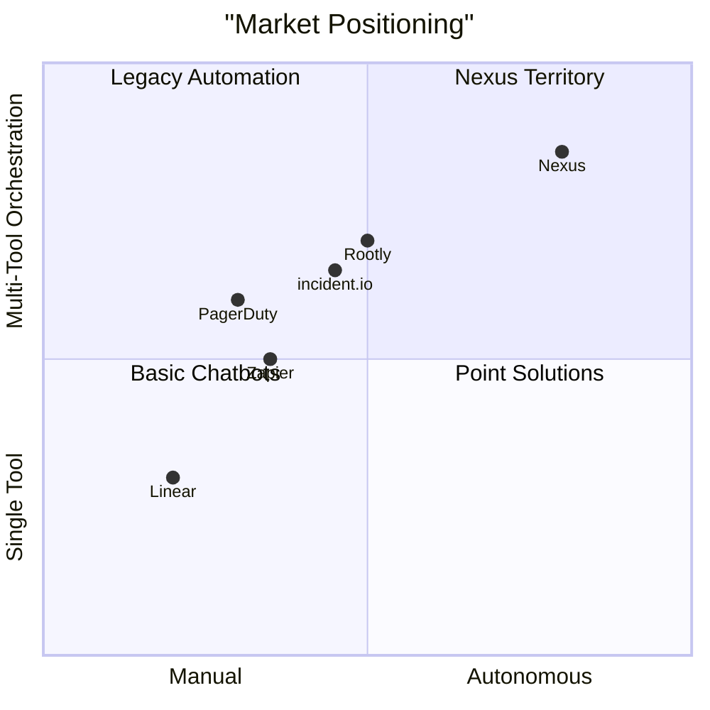

# Nexus — Business Model & Product-Market Analysis

## What Nexus Actually Is

At its core, Nexus is an **autonomous operations copilot** — a system that sits between your existing tools (GitHub, PagerDuty, Slack) and your engineering team. Instead of a human reading an alert, researching the problem, and typing a summary into Slack, Nexus does the entire loop autonomously:

```
External Signal → Decompose → Research → Act → Deliver
   (webhook)     (planner)   (researcher)  (action)   (Slack/email)
```

This is **not** a chatbot. It's a **background autonomous worker** that completes meaningful work without being asked.

---

## The Problem It Solves

### The Core Pain: "Context-Switching Tax" on Engineering Teams

Engineering teams today are drowning in operational signals:

| Signal Type | Volume | Current Process |
|---|---|---|
| GitHub issues | 50-200/week for mid-size teams | Engineer reads issue → searches for similar bugs → looks at code → writes response → assigns |
| PagerDuty alerts | 100-500/week | On-call engineer wakes up → reads alert → checks dashboards → checks recent deploys → writes status update |
| Slack questions | 20-50/day | Someone asks "is X broken?" → engineer investigates → reports back |
| Deploy incidents | 2-10/week | Rollback decision → root cause analysis → post-mortem draft |

**Each of these takes 15-45 minutes of an engineer's time.** Most of it is *research* — looking up logs, searching docs, checking dashboards — not actual decision-making.

> **Nexus replaces the first 80% of that work** — the research, context-gathering, and summary-drafting — and delivers a ready-to-act package in under 60 seconds.

### Why This Matters (Hard Numbers)

- Average engineering team spends **28% of time on operational toil** (Google SRE survey)
- Average MTTR (Mean Time to Respond) for incidents: **30-90 minutes** — Nexus can cut the *investigation* portion to under 1 minute
- AI agents reduce alert fatigue by **50%+ by auto-closing low-fidelity alerts**
- Leading enterprises resolve **60-75% of Tier-1 incidents** without human intervention using agentic AI

---

## 5 Concrete Use Cases for Nexus

### 1. GitHub Issue Triage & Research
**Trigger:** GitHub webhook fires when a new issue is opened.  
**What Nexus does:**
- Planner decomposes the issue into investigation queries
- Researcher searches the web for known solutions, Stack Overflow threads, relevant documentation
- Action agent posts a structured summary with root cause hypotheses, links to relevant resources, and a recommended next step to Slack

**Value:** Saves 20-30 min per issue for the on-call engineer. For a team with 100 issues/week, that's **33-50 hours/week** of engineering time recovered.

### 2. PagerDuty Incident Auto-Triage
**Trigger:** PagerDuty webhook fires on alert threshold breach.  
**What Nexus does:**
- Planner determines what kind of incident this is (CPU, memory, latency, error rate)
- Researcher checks recent deployment history, fetches relevant runbook pages, searches for similar past incidents
- Action agent writes a structured incident brief and posts it to the on-call Slack channel with severity assessment and recommended actions

**Value:** Reduces MTTR from 30+ minutes to < 5 minutes by front-loading the investigation.

### 3. Security Vulnerability Assessment
**Trigger:** Dependabot/Snyk webhook fires when a CVE is found in dependencies.  
**What Nexus does:**
- Planner determines severity and affected packages
- Researcher searches CVE databases, finds exploit status, checks if patches exist, reads advisory details
- Action agent writes a security brief with risk assessment and remediation steps, emails the security team

**Value:** Security teams spend days triaging CVEs. Nexus does the research leg in seconds.

### 4. Pull Request Context Enrichment
**Trigger:** GitHub webhook fires when a PR is opened.  
**What Nexus does:**
- Planner identifies what the PR touches and what questions a reviewer would have
- Researcher searches for related issues, past discussions, coding patterns
- Action agent posts a "reviewer context package" as a PR comment with linked issues, potential risks, and test coverage suggestions

**Value:** Reduces PR review time and catches issues reviewers might miss.

### 5. Recurring Report Generation
**Trigger:** Scheduled cron webhook (weekly).  
**What Nexus does:**
- Planner determines what metrics/events happened this week
- Researcher aggregates data from GitHub (PRs merged, issues closed), PagerDuty (incidents), and other sources
- Action agent compiles a weekly engineering report and sends it via email/Slack

**Value:** Eliminates 1-2 hours/week of manual report compilation.

---

## Competitive Landscape



| Competitor | What They Do | What Nexus Does Differently |
|---|---|---|
| **PagerDuty** ($20-50/user/mo) | Alert routing + on-call management | PagerDuty tells you *something* is wrong. Nexus tells you *what* is wrong and *what to do about it*. |
| **Rootly** (~$20/user/mo) | Slack-native incident lifecycle | Rootly helps you manage incidents. Nexus *investigates* them autonomously. |
| **incident.io** (~$29/user/mo) | Incident response coordination | Similar to Rootly — coordination, not investigation. |
| **Zapier / n8n** (varies) | Rule-based workflow automation | Fixed IF/THEN chains. No reasoning, no research, no adaptation. |
| **GitHub Copilot** ($19/user/mo) | Code completion in the editor | Code-level assistance only. Doesn't operate across tools or handle ops signals. |

> **Nexus's moat:** It's the only system that does autonomous *research and reasoning* across multiple external sources before taking action. Competitors either route alerts or follow fixed rules — none actually *investigate*.

---

## Business Model & Monetization

### Recommended: Hybrid Pricing Model

Based on market research, the optimal model for Nexus combines predictable revenue with usage-aligned scaling:

| Tier | Price | What's Included |
|---|---|---|
| **Starter** | $49/mo (flat) | 100 workflow runs/month, 3 integrations (GitHub + Slack + 1 more), 1 agent pipeline |
| **Pro** | $199/mo + $0.50/workflow | Unlimited integrations, custom pipeline steps, priority execution, email + Slack actions |
| **Team** | $499/mo + $0.30/workflow | Multi-team support, SSO, audit logs, custom tools, SLA guarantees |
| **Enterprise** | Custom | On-prem/VPC deployment, custom agents, dedicated support, compliance |

### Why This Works

1. **Base fee** covers infrastructure costs (DB, compute) and provides predictable revenue
2. **Per-workflow charge** aligns cost with value — customers only pay when Nexus does real work
3. **$0.30-0.50/workflow** is trivially cheap vs. 30 minutes of engineer time ($25-75 at market rates)
4. **Natural upsell:** As teams add more webhook sources and see value, they move up tiers

### Revenue Projections (Conservative)

| Milestone | Customers | Monthly Revenue |
|---|---|---|
| **Month 6** | 20 teams (Starter) | ~$1,000 + ~$500 usage = **$1,500/mo** |
| **Year 1** | 50 Starter + 15 Pro | ~$5,400 + ~$3,000 usage = **$8,400/mo** |
| **Year 2** | 100 Starter + 50 Pro + 10 Team | ~$19,800 + ~$15,000 usage = **$34,800/mo** |

### Alternative: Outcome-Based Pricing (Future)

As Nexus proves its value, transition to **outcome-based pricing**:
- "$X per incident resolved without human intervention"
- "$Y per hours of engineering time saved" (measured by before/after MTTR)
- This model commands **2-5x higher revenue** but requires robust attribution metrics

---

## Market Size

| Segment | 2025 Market Size | Growth Rate |
|---|---|---|
| Enterprise AI Agents | $3-8 billion | **40-48% CAGR** |
| AI in Cybersecurity/Ops | $22-26 billion | 15-20% CAGR |
| Agentic IT Operations | ~$7.8 billion | High |
| Incident Management Tools | ~$3.2 billion | 12% CAGR |

Nexus sits at the intersection of **AI agents** and **incident management** — both high-growth markets. Even capturing 0.01% of the enterprise AI agents market represents $300K-800K ARR.

---

## Strategic Roadmap

### Phase 1: Hackathon → MVP (Now)
- GitHub + PagerDuty + Slack integrations
- 3-agent pipeline (Planner → Researcher → Action)
- Web-based dashboard with live trace view

### Phase 2: Developer Preview (Month 1-3)
- Add more webhook sources (Sentry, Datadog, Jira, Linear)
- Custom pipeline builder (drag-and-drop agent configuration)
- API key management and team accounts
- Usage metering and billing infrastructure

### Phase 3: Product-Market Fit (Month 3-6)
- Outcome tracking (did the Slack message resolve the issue?)
- Feedback loop (human corrections improve future agent behavior)
- Custom tool registry (users add their own API integrations)
- SOC 2 compliance for enterprise

### Phase 4: Scale (Month 6-12)
- Self-hosted/VPC deployment option
- Multi-tenant agent marketplace
- Outcome-based pricing tier
- Enterprise sales motion

---

## One-Liner for Investors

> **Nexus is the autonomous operations copilot that turns engineering alerts into investigated, summarized, and delivered action items — without a human in the loop. PagerDuty tells you something is wrong. Nexus tells you what to do about it.**
